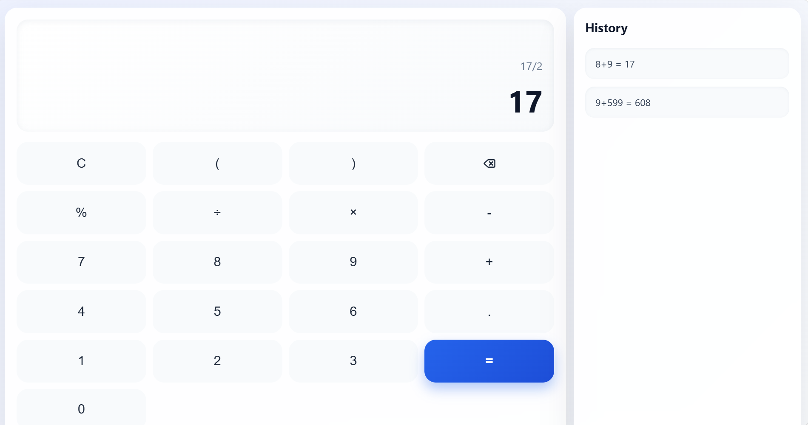
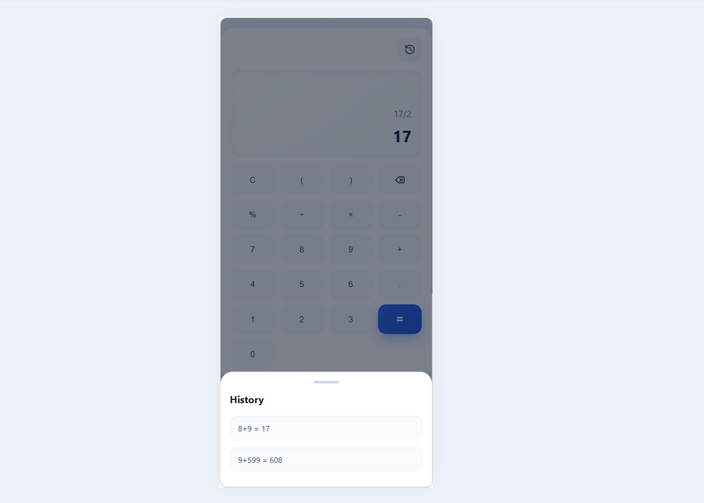

### Calculator Application

## Project Overview

A modern and responsive calculator application built using **SvelteKit and TypeScript**.  
The application provides basic arithmetic operations with keyboard support, calculation history, and a clean user interface.

---

## Features

- Addition, subtraction, multiplication, and division
- Real-time calculation display
- Keyboard input support
- Clear and delete functionality
- Calculation history panel
- Responsive mobile layout
- Reusable Svelte components
- Error handling for invalid expressions
- Percentage calculations
- Modern glassmorphism UI design

---

## Technology Stack

- Frontend: SvelteKit
- Language: TypeScript
- Styling: CSS
- Icons: Lucide Svelte
- Build Tool: Vite

---

## Project Structure

```text
calculator-app/
│
├── src/
│   │
│   ├── lib/
│   │   │
│   │   └── components/
│   │       └── Button.svelte
│   │
│   ├── routes/
│   │   ├── +page.svelte
│   │   └── +layout.svelte
│   │
│   ├── app.css
│   └── ...
│
├── screenshots/
│   ├── calculator.png
│   └── mobile.png
│
├── package.json
├── vite.config.ts
└── README.md
```

---

## Screenshots

### Calculator



---

### Mobile Responsive View



---

## Usage

### Mouse Controls

- Click number buttons to enter values
- Select operators for calculations
- Press `=` to calculate
- Use delete button to remove characters
- Use `C` to clear the display

### Keyboard Controls

Supported keys:

```
Numbers: 0-9
Operators: + - * /
Enter: Calculate
Backspace: Delete
Escape: Clear
Arrow Keys: Navigate buttons
```

